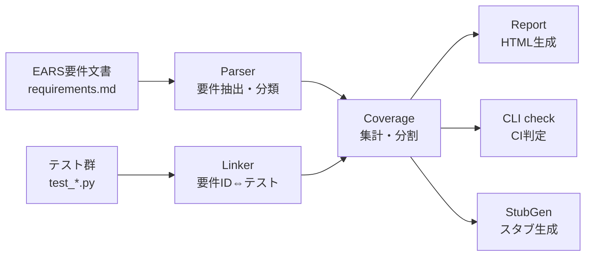

# Design Document

（技術設計書: ears-trace）

## Overview

ears-trace は、EARS 記法で書かれた要件文書とテスト群を突き合わせ、要件ごとの
テスト充足状況（トレーサビリティ）とカバレッジを可視化する CLI ツールである。
本設計は requirements.md の要件（R-01〜R-50）のみを入力とし、それらから素直に
導かれるデータフロー・モジュール分割・データモデル・インターフェース・
エラーハンドリング方針、および検証可能なプロパティ（PBT）を定義する。

設計の基本方針:

- **純粋関数中心**: パース・リンク抽出・集計・レンダリング・スタブ生成は副作用の
  ない純粋関数として実装する。入出力（ファイル読み書き）は CLI 層に隔離する。これにより
  R-35（決定論性）や各種プロパティ（PBT）の検証が容易になる。
- **不変データモデル**: 要件・トレースリンク・カバレッジ結果はイミュータブルな
  データ構造で表現する。集合演算の不変条件（R-23）を型と純粋関数で保証する。
- **頑健性を既定に**: 空・不正・解析不能な入力でも例外で停止せず、空結果や
  スキップで継続する（R-45〜R-50）。

## Architecture

### データフロー

要件から自然に導かれる処理は「入力 → パース → リンク付け → 集計 → 出力」の
一方向パイプラインである。



### モジュール分割と根拠

| モジュール | 責務 | 導出根拠(要件) |
|-----------|------|---------------|
| models | 不変データ構造の定義（Requirement / TraceLink / CoverageReport） | R-09, R-19〜R-25 の集合分割・多対多を型で表現する必要 |
| parser | 要件文書 → 要件抽出・パターン分類・ID採番 | 要件1（R-01〜R-10） |
| linker | テスト群 → 要件ID⇔テストID のリンク抽出 | 要件2（R-11〜R-18） |
| coverage | 要件 + リンク → カバレッジ集計（covered/uncovered分割） | 要件3（R-19〜R-25） |
| report | カバレッジ結果 → 自己完結HTML | 要件4（R-26〜R-31） |
| stub_generator | 未充足要件 → pytestスタブ | 要件5（R-32〜R-36） |
| enrich | EARSパターンの説明補足（任意機能・フォールバック付き） | R-50 |
| cli | サブコマンド分岐・入出力・終了コード | 要件6（R-37〜R-44） |

**分割がなぜ要件から自然に導かれるか:**

- 要件は「パース」「リンク抽出」「集計」「3種の出力」という明確に異なる関心事を
  述べている（要件1〜6）。関心事ごとにモジュールを分けると、各モジュールが
  1つの要件グループに対応し、責務が重ならない（高凝集・低結合）。
- R-19〜R-25 の集合分割（covered/uncovered が排他かつ網羅）は、パースやリンク抽出
  とは独立した「集計」の関心事であり、coverage モジュールとして切り出すのが自然。
- 出力（report / check / generate）は同一の集計結果（CoverageReport）を異なる形に
  変換するだけで、集計ロジックを共有できる。よって集計と出力を分離する。
- ファイル入出力・終了コード・引数解析は要件6のCLI固有の関心事であり、純粋な
  ドメインロジック（parser〜stub_generator）から隔離することで、ドメイン層を
  副作用なしに保ち PBT を可能にする。

### レイヤ構成

```
CLI層 (副作用: ファイルI/O・終了コード・引数解析)   ← cli
--------------------------------------------------
ドメイン層 (純粋関数)                              ← parser / linker / coverage
                                                    report / stub_generator / enrich
--------------------------------------------------
モデル層 (不変データ)                              ← models
```

## Data Models

すべて不変（frozen）なデータ構造として定義する。イミュータブルにすることで、
順序不変性や冪等性のプロパティ（PBT）が壊れにくくなる。

### EarsPattern（列挙）

EARS の 5 パターン + 未分類。R-02, R-05 に対応。

```
UBIQUITOUS  # THE SYSTEM SHALL ...
EVENT       # WHEN ... THE SYSTEM SHALL ...
STATE       # WHILE ... THE SYSTEM SHALL ...
UNWANTED    # IF ... THEN THE SYSTEM SHALL ...
OPTIONAL    # WHERE ... THE SYSTEM SHALL ...
UNKNOWN     # いずれにも該当しない
```

### Requirement（要件・不変）

| フィールド | 型 | 説明 | 対応要件 |
|-----------|----|----|---------|
| id | str | 要件ID（明示 or 採番、一意） | R-07, R-08, R-09 |
| text | str | 正規化済みの要件原文 | R-06 |
| pattern | EarsPattern | 判定されたEARSパターン | R-02, R-05 |

### TraceLink（トレースリンク・不変）

要件IDと、それを充足するテストID群の対応。**要件ID→テストは 1対多**（多対多を
要件側から見た射影）。R-15, R-18, R-20 に対応。

| フィールド | 型 | 説明 | 対応要件 |
|-----------|----|----|---------|
| requirement_id | str | 対象の要件ID | R-19 |
| test_ids | tuple[str, ...] | 充足するテストID（重複排除・整列済み）。空なら未充足 | R-15, R-18, R-20 |
| is_covered | bool（導出） | test_ids が非空か | R-21 |

多対多の表現: 1テストが複数要件を宣言できる（R-15）ため、リンク抽出時は
`要件ID → {テストID}` の写像に集約する。逆向き（1テスト→複数要件）は写像の
値側に同一テストIDが複数要件へ現れることで表現され、情報損失はない。

### CoverageReport（集計結果・不変）

| フィールド | 型 | 説明 | 対応要件 |
|-----------|----|----|---------|
| requirements | tuple[Requirement, ...] | 全要件（出現順） | R-10 |
| links | tuple[TraceLink, ...] | 全要件に1件ずつ対応するリンク | R-19 |
| input_sha256 | str | 入力文書のSHA-256 | R-29 |
| generated_at | str | 生成時刻（UTC, ISO 8601） | R-30 |
| total | int（導出） | 要件総数 | R-28 |
| covered_ids | frozenset[str]（導出） | テスト有りの要件ID集合 | R-21 |
| uncovered_ids | frozenset[str]（導出） | total − covered | R-22 |
| coverage_rate | float（導出） | covered/total、0件なら1.0 | R-24, R-25 |

**集合分割の表現（R-23）**: covered_ids は「is_covered な link の要件ID集合」、
uncovered_ids は「全要件ID − covered_ids」として導出する。差集合で定義することで、
`covered ∪ uncovered = 全要件` かつ `covered ∩ uncovered = ∅` が構造的に保証される。

## Components and Interfaces

各コンポーネントの主要インターフェースは「純粋関数」を基本とし、副作用は cli に
集約する。以下はシグネチャ方針（言語表現は Python 型注釈の意図）。

### parser（要件1）

```
def classify(text: str) -> EarsPattern
    # 1行のEARSパターンを判定。判定順は Unwanted→Event→State→Optional→Ubiquitous
    # （R-03, R-04 の優先度）。いずれにも該当しなければ UNKNOWN（R-05）。

def parse(text: str) -> tuple[Requirement, ...]
    # SHALL を述語として含む行を要件行として抽出(R-01)。ただしインラインコード
    # (バッククォート内)にのみ SHALL が現れる行は除外する(R-01)。正規化(R-06)、
    # 明示ID採用(R-07)／衝突しない採番(R-08)／重複ID一意化(R-09)、出現順で返す(R-10)。
    # 空・非要件のみの入力では空タプルを返す(R-45, R-46)。
```

### linker（要件2）

```
def extract_links_from_source(source: str, *, module: str) -> dict[str, tuple[str, ...]]
    # 1テストソースから 要件ID → テストID群 を抽出。
    # 3方式(マーカーR-11 / 命名R-12 / docstring R-13)を統合し、ID正規化(R-14)、
    # テストIDは module::func 形式(R-16)。解析不能なら空dict(R-47)。

def extract_links_from_paths(paths: list[Path]) -> dict[str, tuple[str, ...]]
    # 複数ファイルを要件ID単位で統合(R-17)、読取不能はスキップ(R-48)、
    # テストIDを重複排除・整列(R-18)。
```

### coverage（要件3）

```
def sha256_of(text: str) -> str
    # 入力のSHA-256（R-29）。

def build_report(
    requirements: tuple[Requirement, ...],
    links_by_requirement: dict[str, tuple[str, ...]],
    *, input_text: str, now: datetime | None = None,
) -> CoverageReport
    # 全要件に1件ずつTraceLinkを生成(R-19)、リンク無しは空集合=未充足(R-20)。
    # now を注入可能にし、生成時刻を固定してテストする(R-30)。純粋関数。
```

### report（要件4）

```
def render_html(report: CoverageReport) -> str
    # 自己完結HTML(R-26)。トレーサビリティ表(R-27)・サマリ(R-28)・
    # 入力ハッシュ(R-29)・UTC時刻(R-30)を埋め込み、特殊文字をエスケープ(R-31)。純粋関数。
```

### stub_generator（要件5）

```
def generate_stubs(report: CoverageReport) -> str
    # uncovered のみを出現順にスタブ化(R-32, R-34)。
    # マーカー＋reqタグ付与で再リンク可能に(R-33)。決定論的・冪等(R-35)。
    # 未充足0件ならヘッダのみ(R-36)。純粋関数。
```

### enrich（R-50）

```
AnnotationFetcher = Callable[[EarsPattern], str | None]

def annotate(pattern: EarsPattern, fetcher: AnnotationFetcher | None = None) -> str
    # fetcher が値を返せば採用、失敗/未提供なら内蔵既定説明へフォールバック(R-50)。
```

### cli（要件6）

```
def build_parser() -> argparse.ArgumentParser
    # report / check / generate の3サブコマンド(R-37)、サブコマンド必須(R-38)。

def main(argv: list[str] | None = None) -> int
    # 終了コードを返す。report:0(R-39)、generate:0(R-43)、
    # check:穴あり&閾値未満で1(R-41)/それ以外0(R-42)。
    # --tests 配下の test_*.py を再帰収集(R-40)、出力先の親を自動作成(R-44)、
    # 存在しないディレクトリはテスト無し扱い(R-49)。
```

## Error Handling

要件7（頑健性）を「ドメイン層は例外で停止しない」方針で実現する。

| 状況 | 方針 | 対応要件 |
|------|------|---------|
| 入力テキストが空 | 空の要件集合を返す（例外なし） | R-45 |
| SHALL を含む行が皆無 | 空の要件集合を返す（例外なし） | R-46 |
| テストファイルが構文解析不能 | そのファイルをスキップし継続 | R-47 |
| ファイル読取不能・文字コード不正 | そのファイルをスキップし継続 | R-48 |
| --tests が存在しないディレクトリ | テスト無し（全要件 uncovered）として継続 | R-49 |
| --enrich の外部取得失敗 | 内蔵既定説明にフォールバック | R-50 |

方針の要点:
- **境界での防御**: 外部入力（文書・テストファイル・外部取得）はドメイン層の入口で
  検証・防御し、想定外でも空結果／スキップに変換する。
- **例外の局所化**: 解析（構文解析・読み取り）で発生し得る例外はその場で捕捉し、
  呼び出し側へ伝播させない。CLI 層は正常系の終了コードを返せる。
- **fail-safe な既定値**: 要件0件時のカバレッジ率は 1.0（R-25）、未充足時のスタブは
  ヘッダのみ（R-36）など、空・境界ケースに明示的な既定を与える。

## Correctness Properties

（プロパティベーステスト: Property-Based Testing）

要件から検証可能な不変条件を抽出し、Hypothesis による PBT で検証する。各プロパティに
対応する要件IDを明記する。ジェネレータは「任意テキスト」「合成した要件文書」
「要件集合＋リンク集合」など、対象プロパティに応じて用意する。

### プロパティ一覧

| # | プロパティ | 不変条件（概略） | 対応要件 |
|---|-----------|-----------------|---------|
| P1 | ラウンドトリップ（冪等） | `parse(text)` の要件ID集合と、その結果をレポート化して再パースした要件ID集合が一致（安定）する | R-10, R-23 |
| P2 | 集合分割 | `covered_ids ∪ uncovered_ids == 全要件ID` かつ `covered_ids ∩ uncovered_ids == ∅` | R-23 |
| P3 | 単調性 | リンク（テスト）を追加すると `\|uncovered\|` は単調非増加（増えない） | R-22, R-24 |
| P4 | 要件ID一意性 | `parse(text)` が返す要件IDに重複がない | R-09 |
| P5 | 生成の決定論性・冪等性 | 同一 CoverageReport から生成したスタブ本文／レポート本文が完全一致する | R-35 |
| P6 | 順序不変性 | 要件の並び順を入れ替えても `coverage_rate` は不変 | R-24 |
| P7 | パーサ頑健性 | 任意の文字列を `parse` してもクラッシュしない（例外を送出しない） | R-45, R-46 |

各プロパティの検証方針は以下のとおり。

### Property 1: ラウンドトリップ（冪等） — R-10, R-23

**Validates: Requirements 1.10, 3.5** （R-10, R-23）
- 生成: 有効なEARS要件行を複数含む合成テキスト。
- 検証: `ids1 = {r.id for r in parse(text)}`。生成物（スタブ／レポート）に現れる要件ID
  集合、または再度 `parse` した結果の要件ID集合が `ids1` と一致すること。パースが
  安定（追加・欠落・変化なし）であることを確認する。

### Property 2: 集合分割 — R-23

**Validates: Requirements 3.5** （R-23）
- 生成: 任意の Requirement 集合と、任意の 要件ID→テストID 写像。
- 検証: `build_report(...)` の `covered_ids | uncovered_ids == {全要件ID}` かつ
  `covered_ids & uncovered_ids == frozenset()`。

### Property 3: 単調性 — R-22, R-24

**Validates: Requirements 3.4, 3.6** （R-22, R-24）
- 生成: 要件集合と 2 段階のリンク集合（`links ⊆ links'`：テストを追加した上位集合）。
- 検証: `len(report(links').uncovered_ids) <= len(report(links).uncovered_ids)` かつ
  `report(links').coverage_rate >= report(links).coverage_rate`。

### Property 4: 要件ID一意性 — R-09

**Validates: Requirements 1.9** （R-09）
- 生成: 明示IDの重複・欠落・混在を含む任意の要件テキスト。
- 検証: `ids = [r.id for r in parse(text)]` に対し `len(ids) == len(set(ids))`。

### Property 5: 決定論性・冪等性 — R-35

**Validates: Requirements 5.4** （R-35）
- 生成: 任意の CoverageReport（生成時刻を固定注入）。
- 検証: `generate_stubs(rep) == generate_stubs(rep)`、および `render_html(rep)` の
  本文（動的なハッシュ・時刻を除く）が繰り返し一致する。時刻はテストで固定注入する。

### Property 6: 順序不変性 — R-24

**Validates: Requirements 3.6** （R-24）
- 生成: 要件集合とそのランダム置換、共通のリンク集合。
- 検証: 並び替え前後で `coverage_rate` が一致する（`covered_ids`/`uncovered_ids` は
  集合なので順序非依存であることも併せて確認）。

### Property 7: パーサ頑健性 — R-45, R-46

**Validates: Requirements 7.1, 7.2** （R-45, R-46）
- 生成: `hypothesis.strategies.text()` による任意文字列（空・制御文字・巨大入力含む）。
- 検証: `parse(text)` が例外を送出せず、常に `tuple[Requirement, ...]` を返す。空・
  非要件入力では空タプルを返す。

### PBT 実装方針

- フレームワークは Hypothesis を用い、pytest から実行する。
- ドメイン関数は純粋関数なので、副作用なしに大量の生成入力を検証できる。
- 生成時刻など非決定要素は引数注入（`now`）で固定し、決定論プロパティを安定させる。
- 各 PBT テストには対応要件IDを `@pytest.mark.requirement("R-XX")` と docstring の
  `req: R-XX` で付与し、ears-trace 自身がこれらのテストを要件へ再リンクできるようにする
  （R-33 と同じ規約でドッグフーディングの自己整合を保つ）。

## Testing Strategy

- **ユニットテスト**: parser の分類優先度（R-03, R-04）、採番・一意化（R-08, R-09）、
  linker の3方式・正規化（R-11〜R-14）、coverage の境界（R-25）、report のエスケープ
  （R-31）、stub の未充足0件（R-36）、cli の終了コード（R-39, R-41〜R-43）。
- **統合テスト**: 要件文書＋テスト群を入力に、report/check/generate のend-to-end。
  出力HTMLにハッシュ・時刻が埋め込まれること（R-29, R-30）、check の非ゼロ終了（R-41）。
- **プロパティテスト（PBT）**: 上記 P1〜P7。
- **カバレッジ目標**: 80% 以上。ears-trace 自身の `check` で自己要件の充足も確認する。
