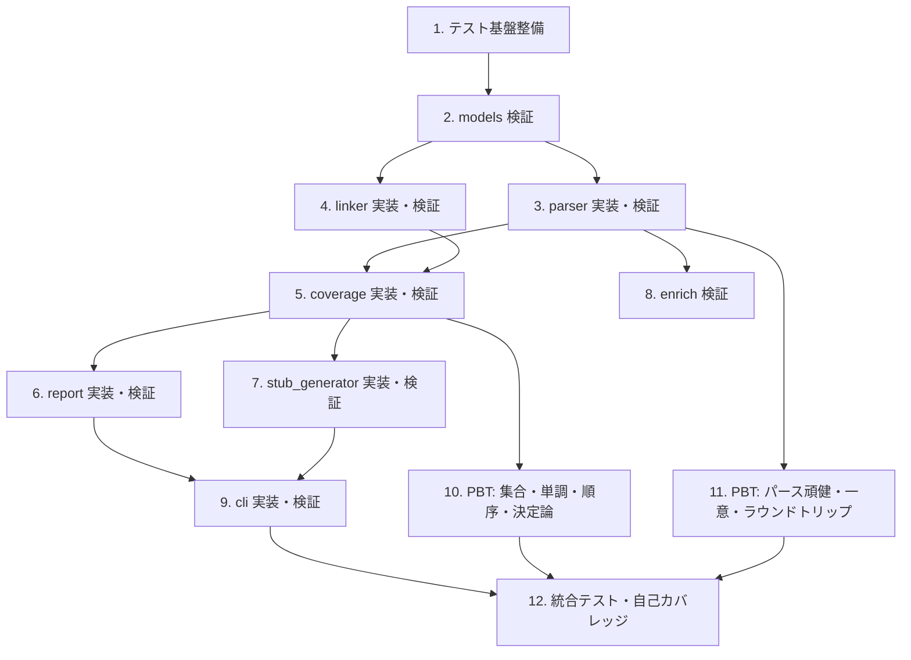

# Implementation Plan

（実装計画: ears-trace）

## Overview

本計画は requirements.md（R-01〜R-50）と design.md に基づき、EARS 要件を満たす
実装とテストを整備する。TDD（テスト先行）を基本とし、design.md で定義した
プロパティ（P1〜P7）を Hypothesis による PBT で検証する。各タスクは対応する要件IDと
プロパティを明記し、ears-trace 自身の `check` で自己カバレッジを担保する（ドッグフーディング）。

## Task Dependency Graph



```json
{
  "waves": [
    { "wave": 1, "tasks": ["1"] },
    { "wave": 2, "tasks": ["2"] },
    { "wave": 3, "tasks": ["3", "4"] },
    { "wave": 4, "tasks": ["5", "8"] },
    { "wave": 5, "tasks": ["6", "7", "10", "11"] },
    { "wave": 6, "tasks": ["9"] },
    { "wave": 7, "tasks": ["12"] }
  ]
}
```

## Tasks

- [x] 1. テスト基盤の整備
  - `tests/` ディレクトリを作成し、`pytest` / `hypothesis` が実行できることを確認する
  - `conftest.py` に共通フィクスチャ（合成要件テキスト、固定 `datetime`）を用意する
  - EARS要件テキストと 要件ID→テストID 写像を生成する Hypothesis ストラテジのモジュールを用意する
  - _Requirements: 全体基盤_

- [x] 2. models の不変条件を検証する
  - `Requirement` / `TraceLink` / `CoverageReport` が frozen（不変）であることを確認する
  - `TraceLink.is_covered` が test_ids の非空判定と一致することを検証する（R-21）
  - `CoverageReport` の `covered_ids` / `uncovered_ids` / `coverage_rate` / `total` の導出を検証する（R-21, R-22, R-24, R-25）
  - `coverage_rate` が要件0件で 1.0 になることを検証する（R-25）
  - _Requirements: R-19, R-20, R-21, R-22, R-24, R-25_

- [x] 3. parser の抽出・分類・採番を実装・検証する
  - [x] 3.1 要件行の抽出と正規化を検証する
    - `SHALL` を含む行のみ抽出することを確認する（R-01）
    - 箇条書き・番号・見出しの接頭辞と前後空白を除去することを確認する（R-06）
    - _Requirements: R-01, R-06_
  - [x] 3.2 EARSパターン分類の優先順位を検証する
    - 5パターンへの分類を網羅的に確認する（R-02）
    - Unwanted > Event、Optional・State > Ubiquitous の優先度を確認する（R-03, R-04）
    - いずれにも該当しない行が Unknown になることを確認する（R-05）
    - _Requirements: R-02, R-03, R-04, R-05_
  - [x] 3.3 ID採用・採番・一意化を検証する
    - 明示IDの採用（R-07）、衝突しない採番（R-08）、重複IDの連番一意化（R-09）を確認する
    - 抽出結果が入力の出現順であることを確認する（R-10）
    - _Requirements: R-07, R-08, R-09, R-10_

- [x] 4. linker のリンク抽出を実装・検証する
  - [x] 4.1 3方式のリンク抽出を検証する
    - マーカー（R-11）／命名規約（R-12）／docstring（R-13）の各方式を確認する
    - 要件IDの正規化（`r01`・`R1` → `R-01`）を確認する（R-14）
    - _Requirements: R-11, R-12, R-13, R-14_
  - [x] 4.2 多対多・統合・整列を検証する
    - 1テスト複数要件／1要件複数テストの保持を確認する（R-15）
    - テストIDが `モジュール名::テスト関数名` 形式であることを確認する（R-16）
    - 複数ファイルの要件ID単位での統合を確認する（R-17）
    - テストIDが重複排除・整列されることを確認する（R-18）
    - _Requirements: R-15, R-16, R-17, R-18_

- [x] 5. coverage の集計と集合分割を実装・検証する
  - 全要件に1件ずつ TraceLink を生成することを確認する（R-19）
  - リンク無しの要件が空集合＝未充足になることを確認する（R-20）
  - covered/uncovered の算出とカバレッジ率を確認する（R-21, R-22, R-24, R-25）
  - `input_sha256` と `generated_at`（UTC, ISO 8601, 注入可能）を確認する（R-29, R-30）
  - _Requirements: R-19, R-20, R-21, R-22, R-24, R-25, R-29, R-30_

- [x] 6. report の HTML 生成を実装・検証する
  - 外部依存のない自己完結HTMLを出力することを確認する（R-26）
  - トレーサビリティ表（ID・パターン・原文・テスト・covered/gap）を確認する（R-27）
  - サマリ（covered/total・カバレッジ率%）を確認する（R-28）
  - 入力ハッシュ（R-29）と UTC 生成時刻（R-30）の埋め込みを確認する
  - 要件原文・テストIDの HTML エスケープを確認する（R-31）
  - _Requirements: R-26, R-27, R-28, R-29, R-30, R-31_

- [x] 7. stub_generator のスタブ生成を実装・検証する
  - uncovered のみを出現順にスタブ化することを確認する（R-32, R-34）
  - 各スタブにマーカー＋`req:` タグが付き再リンク可能なことを確認する（R-33）
  - 決定論性・冪等性（同一入力→同一出力）を確認する（R-35）
  - 未充足0件でヘッダのみになることを確認する（R-36）
  - _Requirements: R-32, R-33, R-34, R-35, R-36_

- [x] 8. enrich のフォールバックを検証する
  - fetcher が値を返せば採用し、失敗・未提供なら内蔵既定説明にフォールバックすることを確認する（R-50）
  - fetcher が例外を送出しても処理を中断しないことを確認する（R-50）
  - _Requirements: R-50_

- [x] 9. cli のサブコマンドと終了コードを実装・検証する
  - [x] 9.1 サブコマンド構成を検証する
    - `report`・`check`・`generate` の提供（R-37）とサブコマンド必須（R-38）を確認する
    - _Requirements: R-37, R-38_
  - [x] 9.2 report / generate の出力と終了コードを検証する
    - `report` が既定/指定パスへHTMLを書き終了コード0（R-39）
    - `generate` が既定/指定パスへスタブを書き終了コード0（R-43）
    - 出力先の親ディレクトリ自動作成（R-44）
    - _Requirements: R-39, R-43, R-44_
  - [x] 9.3 check の判定と test 収集を検証する
    - 穴あり＆閾値未満で非ゼロ終了（R-41）、それ以外は0（R-42）
    - `--tests` 配下の `test_*.py` 再帰収集（R-40）
    - `--min-coverage` 既定 1.0 を確認する（R-41）
    - _Requirements: R-40, R-41, R-42_

- [x] 10. PBT: 集合分割・単調性・順序不変性・決定論性
  - [x] 10.1 集合分割プロパティ（P2）
    - 任意の要件集合＋リンク写像で `covered ∪ uncovered == 全要件` かつ `covered ∩ uncovered == ∅`
    - _Requirements: R-23_
  - [x] 10.2 単調性プロパティ（P3）
    - リンク追加で `|uncovered|` が単調非増加、`coverage_rate` が単調非減少
    - _Requirements: R-22, R-24_
  - [x] 10.3 順序不変性プロパティ（P6）
    - 要件を並べ替えても `coverage_rate` が不変
    - _Requirements: R-24_
  - [x] 10.4 決定論性・冪等性プロパティ（P5）
    - 同一 CoverageReport から生成したスタブ本文が完全一致、HTML本文（時刻固定）が一致
    - _Requirements: R-35_

- [x] 11. PBT: パーサ頑健性・ID一意性・ラウンドトリップ
  - [x] 11.1 パーサ頑健性プロパティ（P7）
    - `strategies.text()` の任意文字列で `parse` が例外を送出せず tuple を返す
    - 空・非要件入力で空タプルを返す
    - _Requirements: R-45, R-46_
  - [x] 11.2 要件ID一意性プロパティ（P4）
    - 重複・欠落・混在を含む任意テキストで `parse` 結果のIDに重複がない
    - _Requirements: R-09_
  - [x] 11.3 ラウンドトリップ/冪等プロパティ（P1）
    - `parse` 結果の要件ID集合が、生成物・再パースを通じて安定している
    - _Requirements: R-10, R-23_

- [x] 12. 統合テストと自己カバレッジの担保
  - 要件文書＋テスト群で report → check → generate の end-to-end を検証する
  - 生成HTMLに入力ハッシュ・UTC時刻が埋め込まれることを確認する（R-29, R-30）
  - 頑健性の統合確認: 空入力・解析不能ファイル・存在しない `--tests` でクラッシュしない（R-45〜R-49）
  - `pytest --cov=src/ears_trace` でカバレッジ 80% 以上を確認する
  - ears-trace 自身の `check` で本 spec の要件充足（自己トレーサビリティ）を確認する
  - _Requirements: R-40, R-45, R-46, R-47, R-48, R-49_

## Notes

- 各タスクは TDD（テスト先行）で進める: 失敗するテストを書き、実装で通し、リファクタする。
- `_Requirements:` の R-XX は requirements.md の受け入れ基準に対応する。
- PBT（タスク10・11）は design.md の Property 1〜7 に対応する（P1=11.3 / P2=10.1 / P3=10.2 / P4=11.2 / P5=10.4 / P6=10.3 / P7=11.1）。
- 完了基準: 全タスクのテストがパスし、カバレッジ 80% 以上、ears-trace 自身の `check` が本 spec に対して緑になること。
- テスト・PBT には `@pytest.mark.requirement("R-XX")` と docstring の `req: R-XX` を付与し、自己トレーサビリティを保つ。
